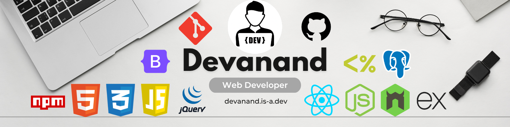
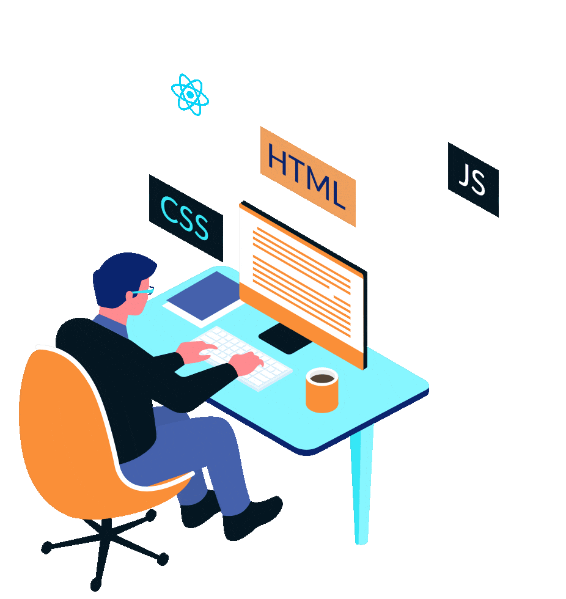

<h1 align="center">💫 Hi 👋 I'm  <em>Devanand</em>  😎</h1>

  
  
  

### **I'm a Web Developer 🖥️**
  

### 🛠️ I’m currently working on:

‣ Building interactive Front-End projects and experimenting with dynamic Web Apps

### 🤝 I’m looking to collaborate on:

‣ Open-Source Front-End Projects, UI/UX improvements, and fun JavaScript challenges

### 🧠 I’m looking for help with:

‣ Advanced React pattern and mastering Back-End tech to become Full-Stack Developer

### 📚 I’m currently learning:

‣ PostgreSQL, APIs, and modern Web Development best practices

### 💬 Ask me about:

‣ HTML5, CSS3, JavaScript, Responsive Design and Git/GitHub

### ⚡ Fun fact:

‣ I believe deploying a project feels like launching a mini-rocket into the internet.

## 🌐 Socials

 

# 💻 Tech Stack

<!-- Frontend -->
 &nbsp;&nbsp;&nbsp;
 &nbsp;&nbsp;&nbsp;
 &nbsp;&nbsp;&nbsp;
 &nbsp;&nbsp;&nbsp;
 &nbsp;&nbsp;&nbsp;
 &nbsp;&nbsp;&nbsp;
 
&nbsp;&nbsp;&nbsp;

<!-- Backend -->

 &nbsp;&nbsp;&nbsp;
 
&nbsp;&nbsp;&nbsp;

&nbsp;&nbsp;&nbsp;

 &nbsp;&nbsp;&nbsp;

 &nbsp;&nbsp;&nbsp;
 
<!-- Tools -->
 &nbsp;&nbsp;&nbsp;
 
&nbsp;&nbsp;&nbsp;
 &nbsp;&nbsp;&nbsp;
 &nbsp;&nbsp;&nbsp;

  
# 📊 GitHub Stats

## 🏆 GitHub Trophies

## ✍️ Random Dev Quote

---

<!-- GitHub -->
 &nbsp;&nbsp;&nbsp;

<!-- LinkedIn -->
 &nbsp;&nbsp;&nbsp;

<!-- Gmail -->
 &nbsp;&nbsp;&nbsp;

<!-- Portfolio Website -->
 &nbsp;&nbsp;&nbsp;

<!-- Resume Download -->
 &nbsp;&nbsp;&nbsp;

<!-- Personal Website (if separate from portfolio) -->

---

 &nbsp;

 &nbsp;

 &nbsp;

 &nbsp;

 &nbsp;

---

 &nbsp;

 &nbsp;

 &nbsp;

 &nbsp;

---

 &nbsp;&nbsp;

 &nbsp;&nbsp;

 &nbsp;&nbsp;

 &nbsp;&nbsp;

---

<!-- LinkedIn -->
 
&nbsp;&nbsp;&nbsp;

<!-- GITHUB -->

&nbsp;&nbsp;&nbsp;&nbsp;&nbsp;&nbsp;&nbsp;&nbsp;&nbsp;

---
