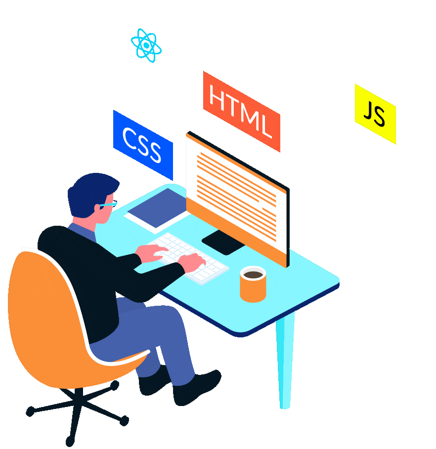

<h1 align="center">👋 Hi there, It's me <em>Devanand</em> 😎</h1>

  
  
  

  
  
  

<!-- 

  

 -->

  

### 🛠️ I’m currently working on:

‣ Building interactive Front-End projects and experimenting with dynamic Web Apps

### 🤝 I’m looking to collaborate on:

‣ Open-Source Front-End Projects, UI/UX improvements, and fun JavaScript challenges

### 🧠 I’m looking for help with:

‣ Advanced React pattern and mastering Back-End tech to become Full-Stack Developer

### 📚 I’m currently learning:

‣ APIs and modern Web Development best practices

### 💬 Ask me about:

‣ HTML5, CSS3, JavaScript, Responsive Design and Git/GitHub

### ⚡ Fun fact:

‣ I believe deploying a project feels like launching a mini-rocket into the internet.

## 🌐 Socials

&nbsp;&nbsp;&nbsp;

&nbsp;&nbsp;&nbsp;

&nbsp;&nbsp;&nbsp;

&nbsp;&nbsp;&nbsp;

# 💻 Tech Stack

<!-- Frontend -->

&nbsp;&nbsp;&nbsp;

&nbsp;&nbsp;&nbsp;

&nbsp;&nbsp;&nbsp;

&nbsp;&nbsp;&nbsp;

&nbsp;&nbsp;&nbsp;

&nbsp;&nbsp;&nbsp;
 

<!-- Backend -->

&nbsp;&nbsp;&nbsp;

&nbsp;&nbsp;&nbsp;

&nbsp;&nbsp;&nbsp;

&nbsp;&nbsp;&nbsp;

&nbsp;&nbsp;&nbsp;
 

<!-- Tools -->

&nbsp;&nbsp;&nbsp;

&nbsp;&nbsp;&nbsp;

&nbsp;&nbsp;&nbsp;

&nbsp;&nbsp;&nbsp;
 

<!-- Editing -->

&nbsp;&nbsp;&nbsp;

&nbsp;&nbsp;&nbsp;

&nbsp;&nbsp;&nbsp; 
 

  
# 📊 GitHub Stats

## 🏆 GitHub Trophies

## ✍️ Random Dev Quote

---
